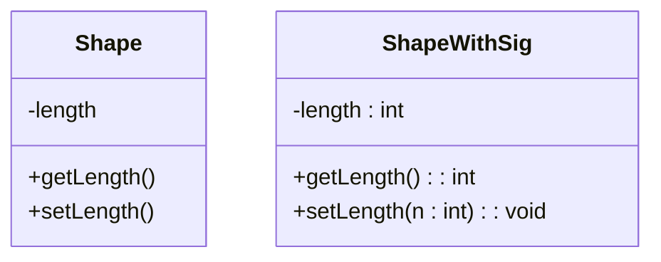
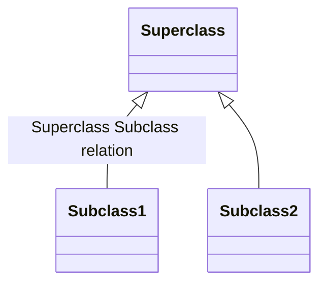

# UML Diagram for UAT Space Program

without signature vs with sig

Attributes come before the attribute or method 
\+ public, \- private, \# protected 

cntl + shift + v to preview 
based on https://mermaid-js.github.io/mermaid/#/
