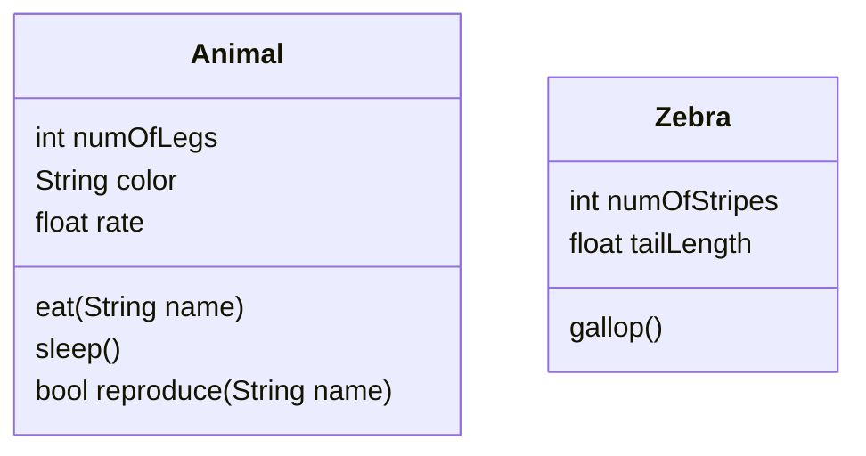

# UML Diagram for UAT Space Program

The uml diagram needs 2 class with 3 properties and 3 methods

```mermaid
    classDiagram
    class Animal{
        int numOfLegs
        String color
        float rate
        eat(String name)
        sleep()
        bool reproduce(String name)
    }
    class Zebra{
        int numOfStripes
        float tailLength
        gallop()
    }

```
